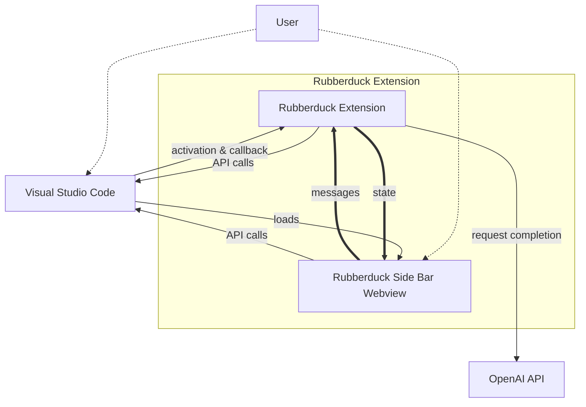

# Architecture - Rubberduck for Visual Studio Code

## Overview

Rubberduck is a [Visual Studio Code extension](https://code.visualstudio.com/api). It has two main components:

- The extension itself, which is the main entry point for the extension. It contains the extension static and logic.
- The sidebar webview, which is a iframe that runs in the sidebar. It renders the UI and forwards user input to the extension.

Visual Studio Code initializes the Rubberduck extension on load. The extension then sets up callback for e.g. the registered commands and initializes the internal structure. The webview is loaded by Visual Studio Code when it is first opened.

## Project Structure

Rubberduck for Visual Studio Code is written in [TypeScript](https://www.typescriptlang.org/). It uses [pnpm](https://pnpm.io/) as package manager and [Nx](https://nx.dev/) for monorepo tooling.

The project is structured as follows:

- [`app/vscode`](https://github.com/rubberduck-ai/rubberduck-vscode/tree/main/app/vscode): Extension assets (e.g. icons, `package.json`, `README.md`, walkthrough pages) and packaging scripts.
- [`doc`](https://github.com/rubberduck-ai/rubberduck-vscode/tree/main/doc): documentation (e.g. architecture)
- [`lib/common`](https://github.com/rubberduck-ai/rubberduck-vscode/tree/main/lib/common): API definitions for the message and state protocol between the extension and the webview. Also contains shared types and utilities.
- [`lib/extension`](https://github.com/rubberduck-ai/rubberduck-vscode/tree/main/lib/extension): The main extension logic.
- [`lib/webview`](https://github.com/rubberduck-ai/rubberduck-vscode/tree/main/lib/webview): The webview. It is written using [React](https://reactjs.org/).
- [`template`](https://github.com/rubberduck-ai/rubberduck-vscode/tree/main/template): Rubberduck Conversation Templates. Some are used in the extension, others are meant as examples for users.
